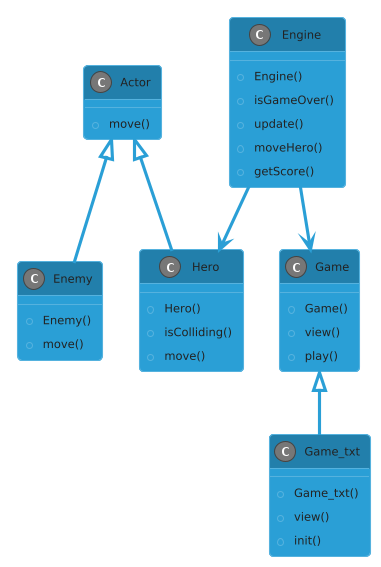

# HeroEnemy

HeroEnemy to gra terminalowa napisana w języku C++. Gracz kontroluje bohatera, unikając wrogów i zdobywając punkty poprzez dotarcie na szczyt planszy. Gra kończy się, gdy gracz zetknie się z wrogiem.

## Instrukcje Obsługi

Gracz steruje postacią za pomocą następujących klawiszy:
- `a` - ruch w lewo
- `d` - ruch w prawo
- `w` - ruch w górę
- `s` - ruch w dół
- `q` - ruch na skos w lewo i w górę
- `e` - ruch na skos w prawo i w górę
- `z` - ruch na skos w lewo i w dół
- `c` - ruch na skos w prawo i w dół

Gra kończy się, gdy gracz zderzy się z wrogiem lub dotrze do górnej krawędzi planszy.

## Struktura Klas

### **1. Actor** *(klasa abstrakcyjna)*
- Reprezentuje postacie w grze.
- Zawiera współrzędne `(x, y)`.
- Posiada metodę wirtualną `move()`, implementowaną przez klasy pochodne.

### **2. Enemy** *(dziedziczy po Actor)*
- Reprezentuje wrogów.
- Przesuwa się w dół planszy i losowo na osi X.
- Implementuje metodę `move()`.

### **3. Hero** *(dziedziczy po Actor)*
- Reprezentuje gracza.
- Może poruszać się w różnych kierunkach.
- Posiada metodę `move()` do zmiany pozycji.
- Zawiera metodę `isColliding()` do sprawdzania kolizji z wrogami.

### **4. Engine**
- Zarządza logiką gry.
- Przechowuje planszę, postacie i wynik gracza.
- Metody:
  - `isGameOver()` - sprawdza stan gry.
  - `update()` - aktualizuje stan gry.
  - `moveHero()` - obsługuje ruch gracza.
  - `getScore()` - zwraca aktualny wynik gracza.

### **5. Game** *(klasa abstrakcyjna, dziedziczy po Engine)*
- Reprezentuje interfejs użytkownika.
- Posiada czysto wirtualną metodę `view()`.
- Zawiera metodę `play()`, odpowiadającą za pętlę gry.

### **6. Game_txt** *(dziedziczy po Game)*
- Implementuje interfejs tekstowy gry.
- Metody:
  - `init()` - inicjalizuje grę.
  - `view()` - wyświetla planszę w terminalu.

## Inicjalizacja Gry
1. Uruchom program.
2. Wybierz poziom trudności: `łatwy`, `średni` lub `trudny`.
3. Rozmiar planszy zostanie dostosowany do poziomu trudności.
4. Rozpocznij grę i zdobywaj punkty!

## Wymagania Systemowe
- Komputer z systemem Windows.
- Dostęp do terminala (cmd).
- Kompilator obsługujący C++ (np. `g++`).

## Kontakt
Autor: **Jakub Ludwiczak**  

